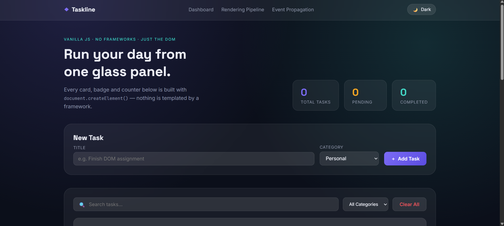
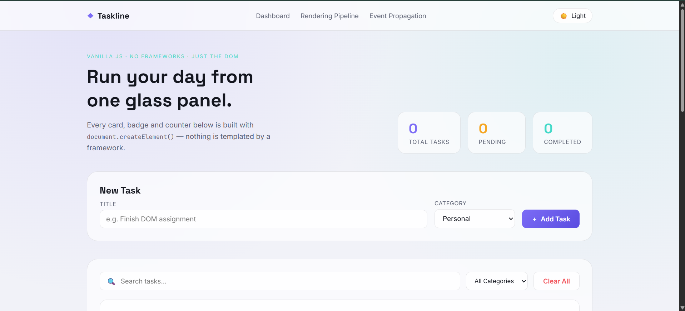
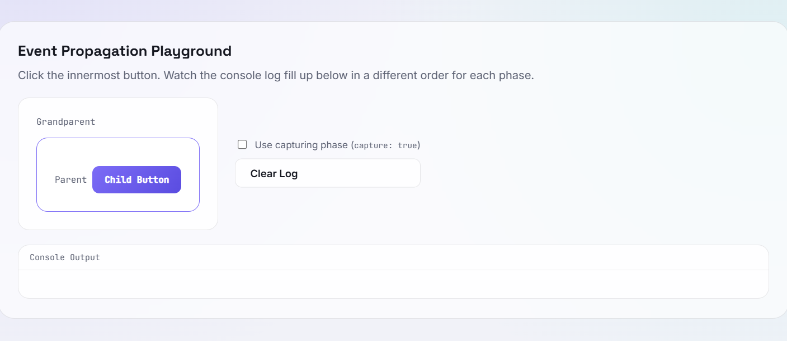

# Taskline — Vanilla JavaScript Task Manager

A fully interactive, dashboard-style Task Manager built with **only HTML5, CSS3, and vanilla JavaScript (ES6)** — no frameworks, no libraries, no CSS toolkits. The project doubles as a working demonstration of core browser and DOM concepts: the rendering pipeline, attributes vs. properties, DOM manipulation, event delegation, and event propagation.

---

## 1. Project Overview

Taskline lets you create, search, filter, edit, complete, and delete tasks in a glassmorphic dashboard UI with dark/light theming. Every task card, badge, and counter is constructed at runtime with the DOM API (`document.createElement()`, `append()`, `appendChild()`, etc.) — nothing is rendered from a template string or a framework.

Beyond the task manager itself, the page includes two dedicated teaching sections:

- **Browser Rendering Pipeline** — a visual, step-by-step card chain explaining how HTML/CSS text becomes pixels on screen.
- **Event Propagation Playground** — a live, nested `grandparent → parent → child` demo with a real-time console log that lets you toggle between the bubbling and capturing phases and watch the order change.

---

## 2. Features

### Core
- Add tasks with a title and category (Personal / Work / Study / Shopping / Others)
- Edit, complete/undo, and delete tasks
- Search tasks by title
- Filter tasks by category
- Live stats: total, pending, completed
- Dark mode / light mode toggle, persisted across reloads
- Fully responsive layout (desktop → mobile)

### Bonus
- Local Storage persistence for both tasks and theme
- `DocumentFragment` batching for efficient list rendering
- Empty-state illustration when no tasks match
- Confirmation dialog before delete / clear-all
- Smooth CSS animations and hover states
- "Clear All" action
- Creation timestamp on every task

---

## 3. Folder Structure

```
taskline/
├── index.html    # Markup: navbar, form, task list, pipeline & propagation sections
├── style.css     # Glassmorphism design system, dark/light themes, responsive rules
├── script.js     # All application logic, heavily commented by concept
└── README.md     # This file
```

---

## 4. How to Run

No build step, no dependencies, no server required.

1. Download/clone the four files into one folder.
2. Open `index.html` directly in any modern browser (Chrome, Firefox, Edge, Safari).

Optional (for a local dev server instead of `file://`):

```bash
# Python 3
python -m http.server 8080

# then visit http://localhost:8080
```

---

## 5. Screenshots

> _Add screenshots here after running the app locally._

- `Dashboard — Dark Mode` — 
- `Dashboard — Light Mode` — 
- `Rendering Pipeline Section` — 
- `Event Propagation Demo` — 

---

## 6. Technologies

| Layer | Choice |
|---|---|
| Structure | HTML5 (semantic elements: `header`, `main`, `section`, `footer`) |
| Styling | CSS3 (custom properties, `backdrop-filter` glassmorphism, Grid/Flexbox, media queries) |
| Behavior | Vanilla JavaScript (ES6): `const`/`let`, arrow functions, template literals, array methods |
| Persistence | Browser `localStorage` |
| Icons | Unicode glyphs only (no icon library) |

---

## 7. Concept Explanations

### Parsing
The browser reads the raw bytes of `index.html` and converts them into a stream of characters, according to the document's declared encoding (`UTF-8` here).

### Tokenization
Those characters are grouped into meaningful tokens — start tags (`<li>`), end tags (`</li>`), attribute name/value pairs (`data-status="pending"`), and text runs — following the HTML tokenizer's state machine.

### DOM Tree
Tokens are converted into **nodes**, and nodes are linked to their parents/children/siblings, producing the Document Object Model: a live, in-memory tree representation of the page that JavaScript can read and mutate.

### CSSOM Tree
CSS is parsed the same way tokens → rules, and turned into the **CSS Object Model** — a tree of every element's computed style properties, built independently of (but in parallel with) the DOM.

### Render Tree
The DOM and CSSOM are combined into the **render tree**: only the nodes that will actually be visually painted (so `display: none` elements, and non-visual nodes like `<head>`, are excluded).

### Layout (Reflow)
For every box in the render tree, the browser calculates its exact size and (x, y) position on the page, based on the viewport, box model, and CSS rules.

### Paint
The browser fills in actual pixels for every box: background colors, borders, text, shadows, the glassmorphism blur — onto one or more layers.

### Composite
Layers are handed to the compositor thread, which merges them in the correct stacking order and draws the final frame to the screen. This is why properties like `transform` and `opacity` (used in this project's hover states) are cheaper to animate than properties that trigger layout.

### Attributes vs. Properties
- **Attributes** are defined in the HTML markup and read via `getAttribute()`. They represent the element's *initial* parsed state and don't change on their own.
- **Properties** live on the live DOM object in memory (e.g. `input.value`) and represent the element's *current* state — for a text input, this updates on every keystroke, completely independent of the original HTML attribute, unless the code explicitly calls `setAttribute()` again.

`script.js` logs a live before/after comparison of `input.value` vs. `input.getAttribute("value")` to the console on page load.

### DOM Manipulation
This project deliberately uses every method the assignment lists, each for a real UI purpose:

| Method | Used for |
|---|---|
| `createElement()` / `createTextNode()` | Building every task card from scratch |
| `append()` | Attaching multiple sibling nodes (badges, buttons) in one call |
| `appendChild()` | Inserting single nodes, and flushing the `DocumentFragment` into the list |
| `prepend()` | Placing a newly added task at the top of the list |
| `before()` | Inserting a temporary "new task" highlight divider ahead of a card |
| `after()` | Inserting a confirmation toast right after the task form |
| `replaceWith()` | Swapping a task's display `<span>` for an editable `<input>` and back; rebuilding a card after its completed/pending status changes |
| `remove()` | Deleting a task card, and cleaning up temporary toast/divider elements |

### Event Bubbling
When an event fires on an element, it doesn't just fire there — it then **bubbles** upward through every ancestor, from the target outward to `window`. Clicking the "Child Button" in the propagation demo (default settings) logs `Child → Parent → Grandparent`, because each ancestor's listener runs during this outward bubbling phase.

### Event Capturing
The mirror image of bubbling: before an event ever reaches its target, it first travels **down** from `window` through every ancestor to the target. Listeners registered with `{ capture: true }` fire during this inward phase. Toggling "Use capturing phase" in the demo logs `Grandparent → Parent → Child`.

Every click actually passes through **three** phases every time: **Capturing → Target → Bubbling** — we're just choosing which phase our listeners react during.

### Event Delegation
Rather than attaching a `click` listener to every Edit/Complete/Delete button on every task card (which would need to be re-attached every time the list re-renders), a **single** listener sits on the parent `<ul id="taskList">`. Because clicks bubble, a click anywhere inside any task card eventually reaches that one listener, which uses `event.target.closest('button[data-action]')` to figure out exactly what was clicked and act accordingly. This scales to any number of tasks with zero extra listeners.

### Local Storage
`localStorage.setItem()` / `getItem()` persist the serialized (`JSON.stringify`) task array and the current theme string under fixed keys, so both survive a full page reload.

### DocumentFragment
A `DocumentFragment` is a lightweight, in-memory container that lives **outside** the real DOM tree. Building a batch of task `<li>` elements inside a fragment first, then appending the fragment to `taskList` in one call, avoids triggering a separate reflow/repaint for every single task — the browser only has to lay out and paint once for the whole batch.

---

## 8. Future Improvements

- Drag-and-drop task reordering
- Due dates + reminder notifications
- Task priority levels with color coding
- Multi-select bulk actions (bulk complete/delete)
- Export/import tasks as JSON
- Undo toast after delete (instead of only a `confirm()` dialog)
- Accessibility pass: full keyboard navigation for the propagation demo and task actions

---

Built as a demonstration of vanilla DOM fundamentals — no React, Vue, Angular, jQuery, Bootstrap, or Tailwind anywhere in this codebase.